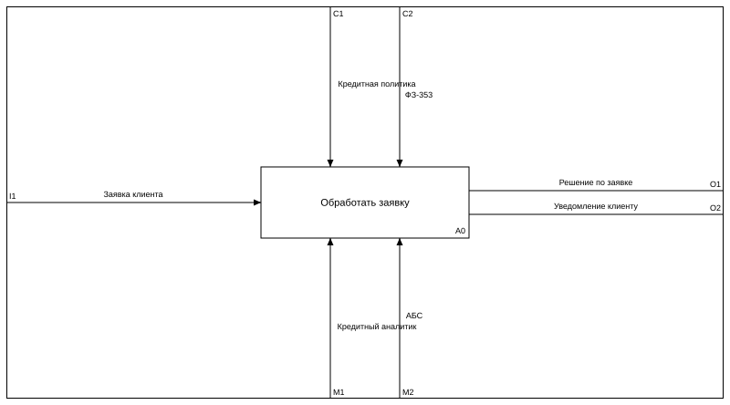
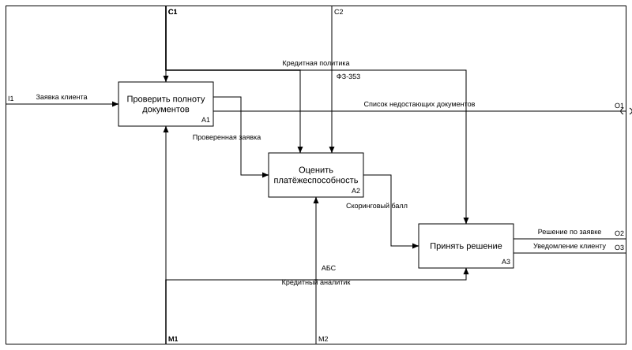

# idefy

Генератор IDEF0-моделей из декларативного YAML: валидация нотации, автораскладка,
превью в SVG/PNG и сборка нативного файла Ramus (`.rsf`).

Модель — это файл в вашем репозитории. Картинки и `.rsf` — производные артефакты,
их место в `.gitignore`.

Java и сам Ramus для сборки не нужны: `.rsf` — zip с дампом таблиц, и `idefy`
пишет его напрямую. Ramus нужен только чтобы открыть результат.

## Установка

```bash
uv tool install git+https://github.com/Trum-ok/idefy
```

PNG-превью требует дополнительной зависимости:

```bash
uv tool install "idefy[png] @ git+https://github.com/Trum-ok/idefy"
```

Нужен Python 3.12 или новее.

## Быстрый старт

```bash
idefy init model.yaml
idefy validate model.yaml
idefy preview model.yaml
idefy build model.yaml
```

`init` кладёт рядом модель, `validate` проверяет её по правилам нотации,
`preview` рисует каждую диаграмму отдельным файлом, `build` собирает `.rsf`.
Подробности — в [справочнике по командам](cli.md).

## Пример

```yaml
version: 1

model:
  name: "Обработка заявки на кредит"
  author: "Аркадий Артамонов"
  purpose: "Описать порядок обработки заявки для последующей автоматизации"
  viewpoint: "Кредитный аналитик"

activities:
  - id: A0
    name: "Обработать заявку"
    input: [ "Заявка клиента" ]
    control: [ "Кредитная политика", "ФЗ-353" ]
    output: [ "Решение по заявке", "Уведомление клиенту" ]
    mechanism: [ "Кредитный аналитик", "АБС" ]

  - id: A1
    name: "Проверить полноту документов"
    input: [ "Заявка клиента" ]
    control: [ "Кредитная политика" ]
    output: [ "Проверенная заявка", "Список недостающих документов" ]
    mechanism: [ "Кредитный аналитик" ]

  - id: A2
    name: "Оценить платёжеспособность"
    input: [ "Проверенная заявка" ]
    control: [ "Кредитная политика", "ФЗ-353" ]
    output: [ "Скоринговый балл" ]
    mechanism: [ "АБС" ]

  - id: A3
    name: "Принять решение"
    input: [ "Скоринговый балл" ]
    control: [ "Кредитная политика" ]
    output: [ "Решение по заявке", "Уведомление клиенту" ]
    mechanism: [ "Кредитный аналитик" ]

arrows:
  - name: "Список недостающих документов"
    from: A1
    to: external
    tunnel: dest
```

Контекстная диаграмма:

{ loading=lazy }

Её декомпозиция:

{ loading=lazy }

Стрелки в модели не объявлены — они выведены сопоставлением имён в ICOM-списках.
Единственная запись в блоке `arrows` нужна там, где авторазрешение не справилось:
«Список недостающих документов» никем не потребляется и уходит за рамку.

## Что дальше

- [Язык](dsl.md) — все поля, правила разрешения стрелок, коды диагностик.
- [Команды](cli.md) — флаги, машинный вывод, коды возврата, конфигурация.
- [Нотация IDEF0](idef0.md) — памятка для тех, кто с нотацией не работал.
